# 基于Java+Springboot+Vue学生宿舍管理微信小程序-毕业设计

# 获取地址

#### 作者QQ：3275035005 微信：xkbishe123 (支持修改、 部署调试、 代做接毕业设计和课程设计)

#### 网站建设、小程序、H5、APP、各种系统、样式修改、10000套源码可选。

#### 选题+开题报告+任务书+程序定制+安装调试+论文+答辩ppt 都可以做

#### 问题包修改，包满意，有需求尽管甩过来！一条龙帮你安心过！

#### 所有项目以及源代码本人均调试运行无问题 可支持远程调试运行

# 项目介绍
基于基于SpringBoot学生宿舍管理微信小程序-毕业设计，本系统分微信小程序和管理后台两部分，项目采用前后端分离

 **用户**
		账号登录、查看校园新闻、查看公告信息、查看轮播图、查看违规记录、卫生查询、发布留言、请假申请、个人信息修改、请假记录、密码修改、查看我的留言、退出登录等功能

 **管理员**
    		登录、首页、出入登记管理、请假申请管理、公寓管理、违规管理、卫生管理、学生管理、留言管理、公告管理等功能。

# 技术框架
- 开发语言：Java 
- 数据库：Mysql 
- 系统环境：jdk8、maven、node
- 后端框架：SpringBoot、MyBatisplus、MyBatis
- 前端框架：Vue、Elementui、微信小程序
- 工具：IDEA、Navicat、HBuilder、微信开发者工具
- 技术架构：前后端分离、B/S架构、MVC架构
# 项目截图

### 1. 微信端

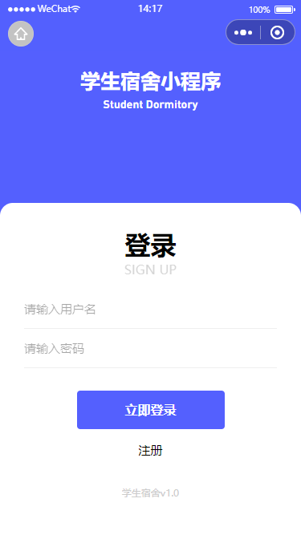

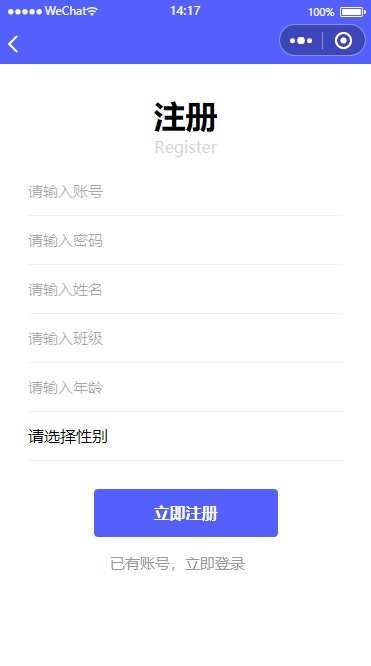

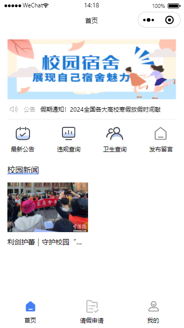

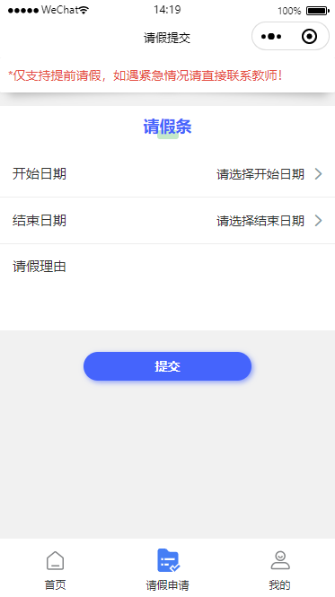

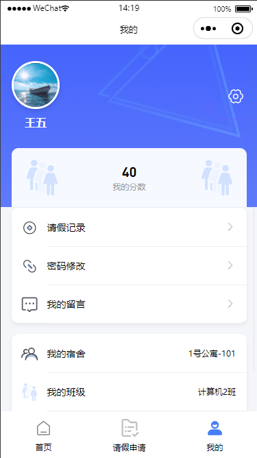

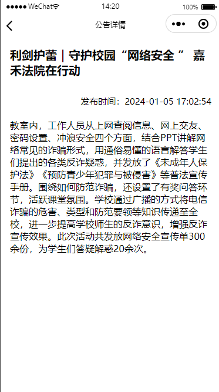

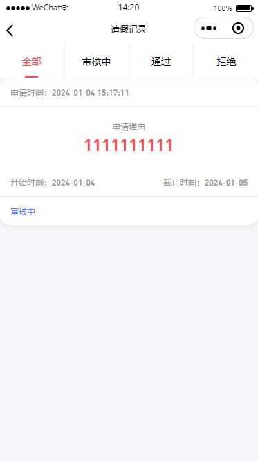

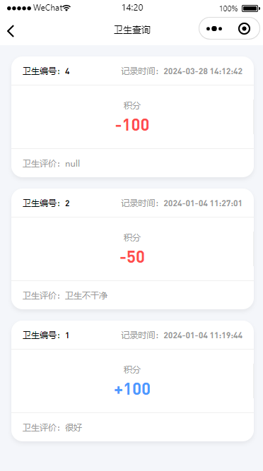

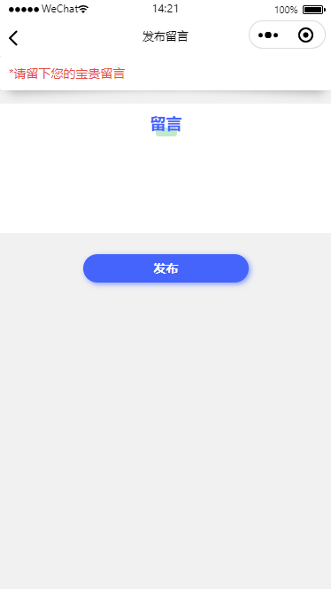

### 2. 管理端

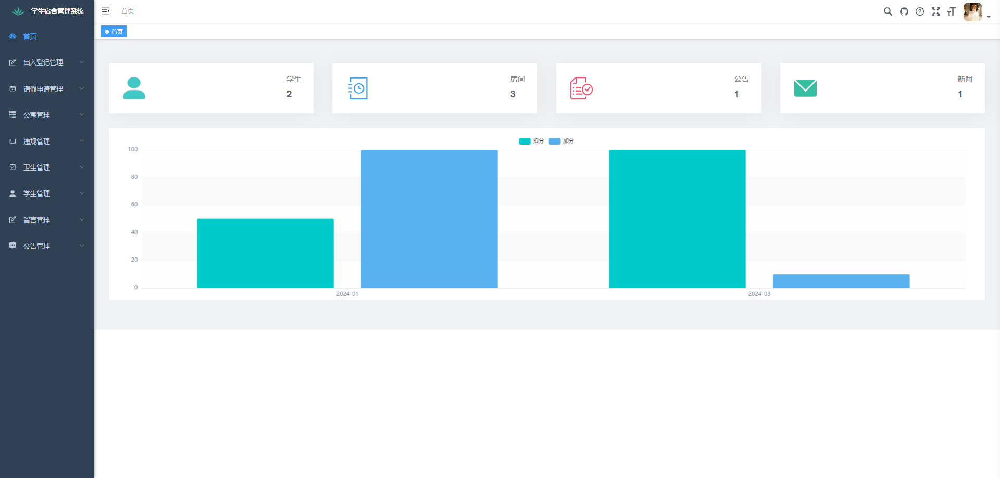

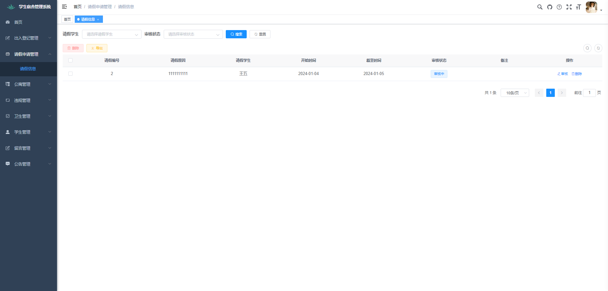

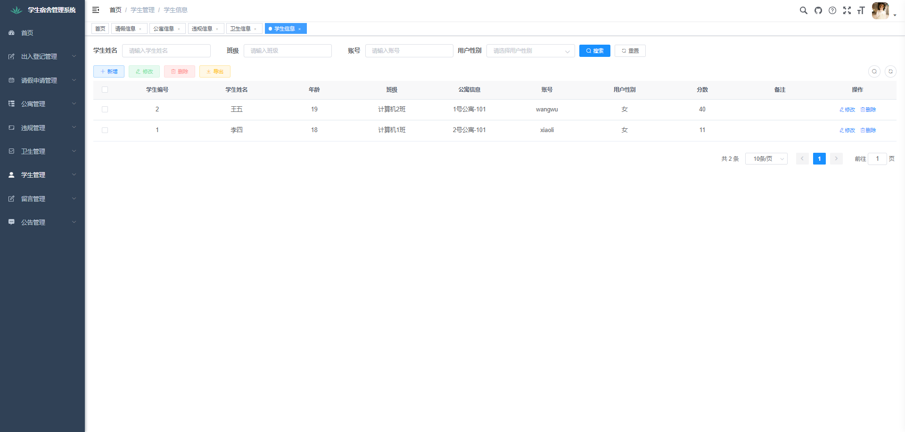

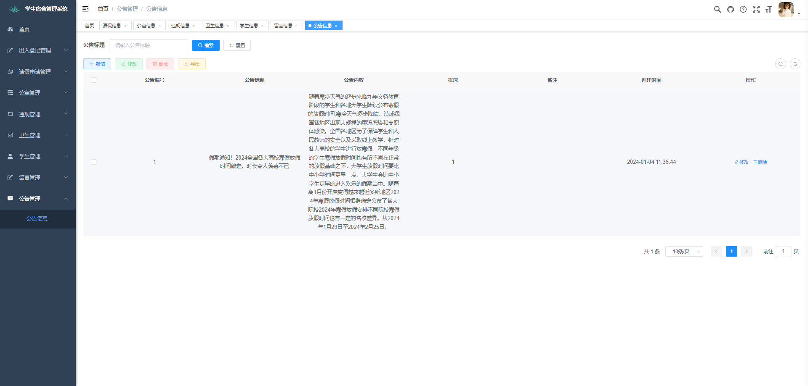

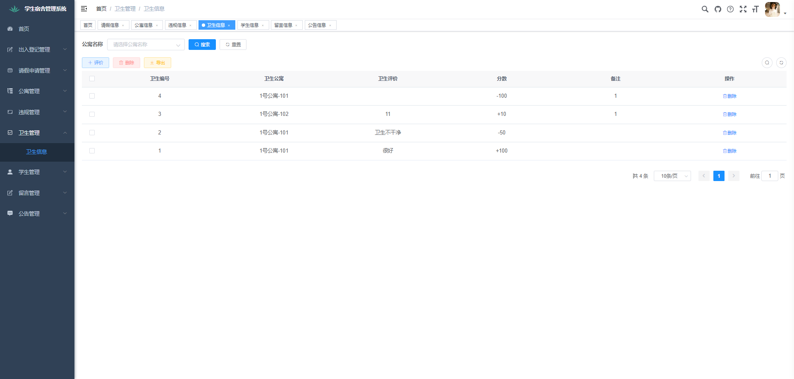

